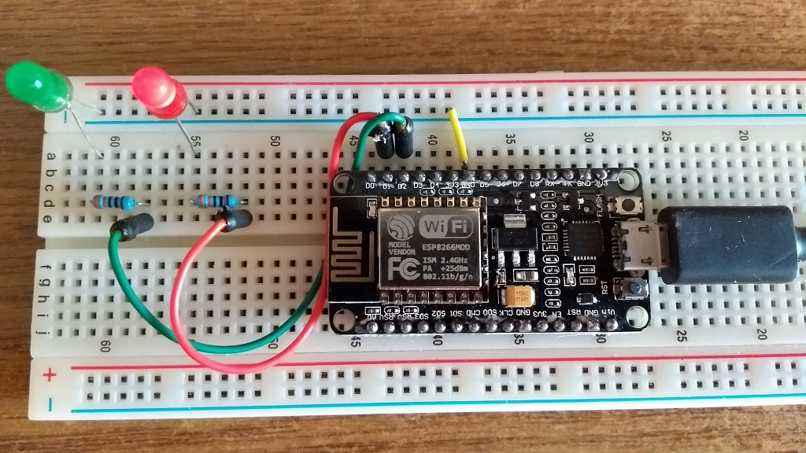

# Welcome to SlackLED

This Arduino project contains a sample/demo application to turn on and off LED based on your Slack persence.

Project picture
-----------------

Hardware
-----------------
Required components:
* NodeMCU 1.0 ESP-12 ESP8266 development board (or a similar one)
* LEDs
* Resistors

Software
-----------------
To get your current presence this program use the Slack API's users.getPresence method over a secured connection and drive the LEDs.
To do this you will need a User token (starts with xoxp-) from Slack.

Slack API / users.getPresence method: [https://api.slack.com/methods/users.getPresence](https://api.slack.com/methods/users.getPresence)
Slack User token: [https://api.slack.com/docs/token-types#user](https://api.slack.com/docs/token-types#user)

Configuration
-----------------
The following setting need to be updated in the Config.h file:
* WiFi (ssid and password)
* User token
* LED pins (maybe)
* Fingerprint (if Slack changes their certificate)

Note:
-----------------
You can find more informatin about ESP8266, IoT and Cloud my Facebook page: [https://www.facebook.com/flyingiot/](https://www.facebook.com/flyingiot/)
Thank you.
